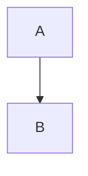
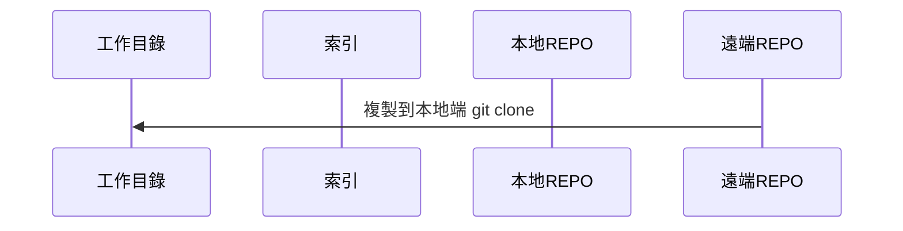
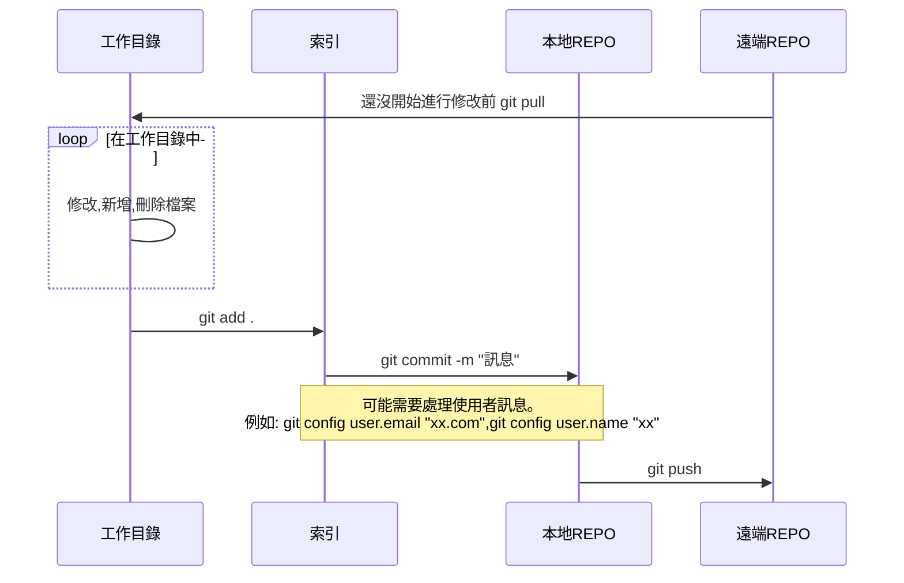

## mermaid 介紹
流程圖

## 一般圖形

```mermaid
graph TD
A-->B
```
## 時序 

## 範例 熟悉git 流程

### 在本地新建(複製)一個遠端REPO

```mermaid
sequenceDiagram
    participant 工作目錄
    participant 索引
    participant 本地REPO
    participant 遠端REPO
    遠端REPO->>工作目錄: 複製到本地端 git clone
 
```

### 在本地修改完成以後上傳

```mermaid
sequenceDiagram
    participant 工作目錄
    participant 索引
    participant 本地REPO
    participant 遠端REPO
    遠端REPO->>工作目錄: 還沒開始進行修改前 git pull
    loop 在工作目錄中
     工作目錄->工作目錄: 修改,新增,刪除檔案
    end
    工作目錄->>索引:git add .
    索引->>本地REPO:git commit -m "訊息"
    note over 索引,本地REPO: 可能需要處理使用者訊息。<br/>例如: git config user.email "xx.com",git config user.name "xx"
    本地REPO->>遠端REPO: git push
 
```

xx
