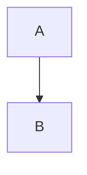
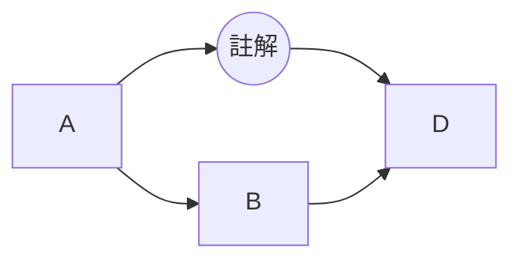
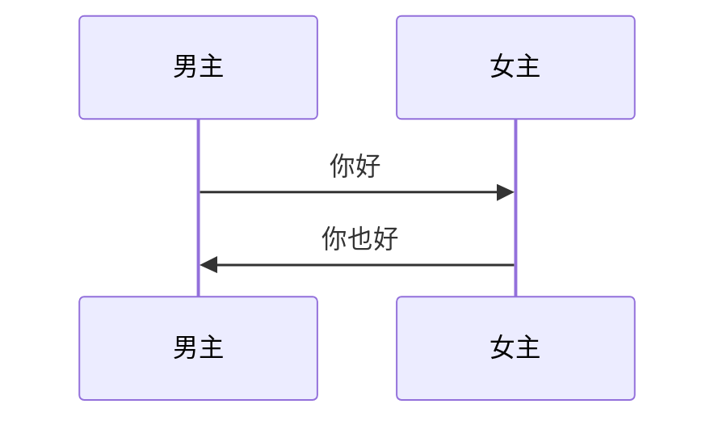
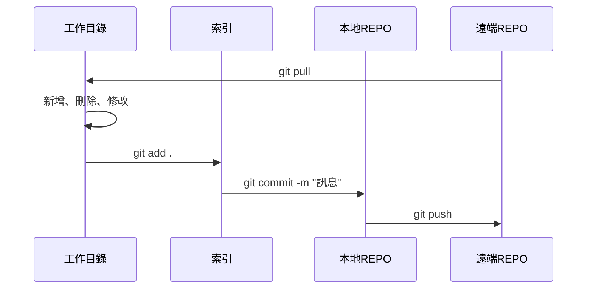

# mermaid 簡介
也是一個電腦語言。 主要是用**文字**畫圖的語言。

## mermaid 練習
### 一般流程

```mermaid
graph TD
A-->B
```
example

```mermaid
graph LR
A-->B
A-->C((註解))
C((註解))-->D
B-->D
```

## 時序圖

```mermaid
sequenceDiagram
    participant 男主
    participant 女主
    男主->>女主: 你好
    女主->>男主: 你也好
```

example

```mermaid
sequenceDiagram
    participant 工作目錄
    participant 索引
    participant 本地REPO
    participant 遠端REPO
    遠端REPO->>工作目錄: git pull
    %%loop 開發
    工作目錄->>工作目錄: 新增、刪除、修改
    %%end
    工作目錄->>索引: git add .
    索引->>本地REPO: git commit -m "訊息"
    本地REPO->>遠端REPO: git push

```

